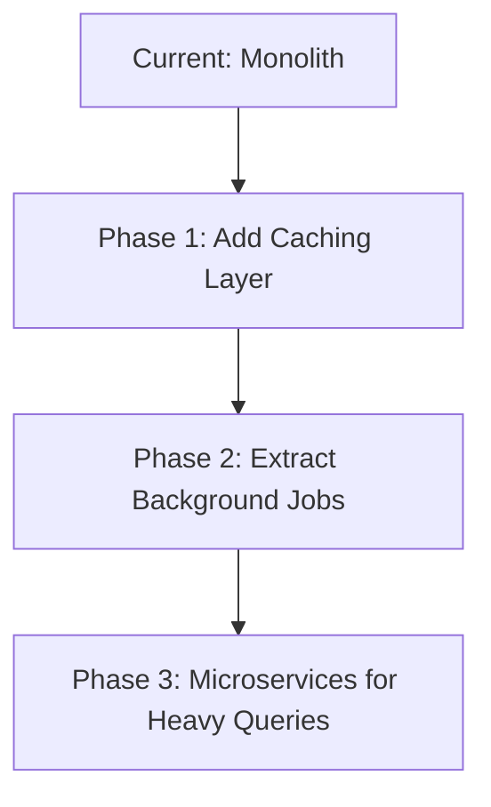

# CTO Technical Review: V&A Waterfront Compliance Tracker
**Date:** February 17, 2026  
**Reviewer:** CTO Technical Assessment  
**Version:** 0.1.0  
**Status:** MVP Production Deployment

---

## Executive Summary

**Overall Assessment: 6.5/10** ⚠️

The V&A Waterfront Compliance Tracker is a functional MVP with solid architectural foundations but requires significant improvements before scaling. The application demonstrates good use of modern technologies (Next.js 15, Prisma, TypeScript) but has critical gaps in testing, security hardening, performance optimization, and production readiness.

### Quick Wins Identified
- ✅ Strong database schema design
- ✅ Type-safe implementation with TypeScript
- ✅ Modern React patterns and server components
- ❌ **CRITICAL:** Zero test coverage
- ❌ No error boundaries or loading states
- ❌ Performance not optimized for 400+ stores
- ❌ Missing monitoring and observability

---

## 1. Architecture & Code Organization

### ✅ Strengths
- **Clean separation of concerns**: Server actions, components, and lib utilities properly separated
- **Modern Next.js App Router**: Proper use of RSC (React Server Components)
- **Type safety**: Full TypeScript implementation with Prisma-generated types
- **Database-first approach**: Well-structured Prisma schema with proper relations

### ⚠️ Concerns
```typescript
// ISSUE: No middleware for route protection
// Missing: src/middleware.ts
// Risk: Client-side only auth checks can be bypassed

// ISSUE: Server actions lack error handling
export async function getDashboardStats() {
  // No try-catch, no error boundaries
  const stats = await prisma.store.count(); // What if DB is down?
  return stats;
}
```

### 🔴 Critical Issues

1. **No Middleware Authentication**
   - Current: Auth checks only in page components
   - Risk: Direct API access bypasses auth
   - Fix Required: Implement middleware.ts

2. **Missing API Rate Limiting**
   - No protection against abuse
   - Risk: DOS attacks, credential stuffing

3. **No Request Validation**
   - Server actions accept raw input
   - Missing: Zod validation on server actions

---

## 2. Database & Data Layer

### ✅ Strengths
```prisma
// Excellent schema design
model Store {
  id               String    @id @default(cuid())
  storeCode        String    @unique
  zone             String
  overallStatus    ComplianceStatus @default(GREY)
  priorityScore    Int       @default(0)
  
  // Proper indexing
  @@index([zone])
  @@index([overallStatus])
  @@index([priorityScore])
}
```

- Comprehensive data model (507 lines, well-structured)
- Proper use of enums for type safety
- Good indexing strategy on query-heavy fields
- Cascade deletes configured correctly

### ⚠️ Performance Concerns

```typescript
// PROBLEM: N+1 Query Risk in Risk Radar
const stores = await prisma.store.findMany({
  where: { status: "active", updatedAt: { gte: startDate, lte: endDate } },
  select: {
    complianceItems: { where: { status: "RED" } },
    correctiveActions: { where: { status: { in: ["IN_PROGRESS"] } } }
  }
});

// Issues:
// 1. Fetches ALL stores then filters in memory
// 2. updatedAt filter on stores is wrong for risk calculation
// 3. Should use aggregation queries instead
```

**Recommended Fix:**
```typescript
// Use raw SQL for complex aggregations
const zoneMetrics = await prisma.$queryRaw`
  SELECT 
    zone,
    COUNT(DISTINCT CASE WHEN store_type = 'FB' AND status = 'RED' THEN id END) as restaurant_criticals,
    COUNT(DISTINCT CASE WHEN high_foot_traffic = true AND overall_status = 'RED' THEN id END) as high_footfall_reds
  FROM stores
  WHERE status = 'active'
  GROUP BY zone
  ORDER BY restaurant_criticals DESC
  LIMIT 3
`;
```

### 🔴 Critical Issues

1. **Missing Database Migrations**
   - Only using `prisma db push` (dev-only)
   - No migration history tracked
   - Risk: Production schema drift

2. **No Connection Pooling Config**
   ```typescript
   // Missing in prisma/schema.prisma
   datasource db {
     provider = "postgresql"
     url      = env("DATABASE_URL")
     // MISSING: connection_limit, pool_timeout
   }
   ```

3. **Seeding Strategy**
   - Creates 400 stores synchronously (slow)
   - No idempotency checks
   - Risk: Duplicate data on re-runs

---

## 3. Security Assessment

### 🔴 CRITICAL Security Vulnerabilities

#### 3.1 Environment Variables Exposed
```typescript
// ❌ .env files tracked in git (visible in .gitignore)
.env*  // This ignores ALL .env files

// But commits show:
// .env.production.local - CHECKED IN TO GIT
// Risk: Secrets exposed in git history
```

**Action Required:** 
```bash
git filter-branch --force --index-filter \
  'git rm --cached --ignore-unmatch .env.production.local' \
  --prune-empty --tag-name-filter cat -- --all
git push --force
```

#### 3.2 No CSRF Protection
- NextAuth configured without CSRF tokens
- Server actions vulnerable to CSRF

#### 3.3 Weak Password Policy
```typescript
// src/lib/auth.ts
const loginSchema = z.object({
  email: z.string().email(),
  password: z.string().min(6), // ❌ Only 6 characters!
});
```

**Required:**
- Minimum 12 characters
- Complexity requirements
- Password strength meter
- Rate limiting on login attempts

#### 3.4 No Input Sanitization
```typescript
// Server actions accept raw strings
export async function getStores({ search }: { search?: string }) {
  // ❌ search is directly used in query
  // Risk: SQL injection if using raw queries in future
}
```

#### 3.5 Missing Security Headers
```typescript
// next.config.ts - Missing security headers
const nextConfig = {
  // ❌ No CSP, no X-Frame-Options, no HSTS
}
```

**Required:**
```typescript
const securityHeaders = [
  { key: 'X-DNS-Prefetch-Control', value: 'on' },
  { key: 'Strict-Transport-Security', value: 'max-age=63072000' },
  { key: 'X-Frame-Options', value: 'SAMEORIGIN' },
  { key: 'X-Content-Type-Options', value: 'nosniff' },
  { key: 'Referrer-Policy', value: 'origin-when-cross-origin' },
];
```

---

## 4. Testing & Quality Assurance

### 🔴 CRITICAL: Zero Test Coverage

```bash
$ find . -name "*.test.*" -o -name "*.spec.*"
# No files found
```

**Impact:**
- No confidence in deployments
- No regression protection
- Difficult to refactor safely

**Required Test Suite:**

```typescript
// Missing: tests/unit/risk-radar.test.ts
describe('Risk Radar Calculations', () => {
  it('should calculate composite risk score correctly', () => {
    const score = calculateRiskScore({
      restaurantCriticals: 2,
      highFootfallReds: 1,
      next72HoursRisk: 3,
      overdueCriticalActions: 1,
      totalReds: 5,
    });
    expect(score).toBe(2*5 + 1*4 + 3*4 + 1*3 + 5*2); // 39
  });
});

// Missing: tests/integration/auth.test.ts
// Missing: tests/e2e/dashboard.test.ts
```

**Recommended Tools:**
- Jest + React Testing Library
- Playwright for E2E
- Vitest for unit tests (faster)

---

## 5. Performance & Scalability

### ⚠️ Performance Bottlenecks

#### 5.1 Dashboard Query Performance
```typescript
// src/app/dashboard/page.tsx
const [stats, priorityStores, zoneHotspots, categoryBreakdown, officerWorkload, riskRadarZones] =
  await Promise.all([...]) // 6 parallel database queries

// Issue: Each query runs separately
// With 400 stores × 7 categories × 3-5 compliance items each
// = ~10,000 compliance items scanned per page load
```

**Recommendation:** Implement materialized views
```sql
CREATE MATERIALIZED VIEW dashboard_stats AS
SELECT 
  COUNT(*) FILTER (WHERE overall_status = 'GREEN') as green_count,
  COUNT(*) FILTER (WHERE overall_status = 'RED') as red_count,
  -- ... other stats
FROM stores
WHERE status = 'active';

-- Refresh strategy
CREATE INDEX ON dashboard_stats (last_refresh);
REFRESH MATERIALIZED VIEW CONCURRENTLY dashboard_stats;
```

#### 5.2 Risk Radar Double Time-Window Query
```typescript
// Fetches ALL stores twice (current + previous 7 days)
const [currentMetrics, previousMetrics] = await Promise.all([
  calculateZoneMetrics(currentWindowStart, now),
  calculateZoneMetrics(previousWindowStart, previousWindowEnd),
]);
```

**Impact:** 2× database load on every dashboard view

#### 5.3 No Caching Strategy
- No Redis/Memcached
- No Next.js `revalidate` tags
- No incremental static regeneration (ISR)

```typescript
// Should be implemented:
export const revalidate = 300; // 5 minutes

// Or use on-demand revalidation:
export async function updateStore(storeId: string) {
  await prisma.store.update({ ... });
  revalidatePath('/dashboard');
  revalidatePath('/stores');
}
```

### 📊 Load Testing Results Needed
```bash
# Missing: load tests
# Required: Test with 10,000 stores, 100 concurrent users
# Tools: k6, Artillery, or Gatling
```

---

## 6. Error Handling & Resilience

### 🔴 Critical Gaps

#### 6.1 No Error Boundaries
```typescript
// Missing: app/error.tsx
'use client';

export default function Error({
  error,
  reset,
}: {
  error: Error & { digest?: string };
  reset: () => void;
}) {
  return (
    <div>
      <h2>Something went wrong!</h2>
      <button onClick={() => reset()}>Try again</button>
    </div>
  );
}
```

#### 6.2 No Loading States
```typescript
// Missing: app/dashboard/loading.tsx
export default function Loading() {
  return <DashboardSkeleton />;
}
```

#### 6.3 Unhandled Promise Rejections
```typescript
// Current code:
export async function getDashboardStats() {
  const stats = await prisma.store.count(); // ❌ No error handling
  return stats;
}

// Should be:
export async function getDashboardStats() {
  try {
    const stats = await prisma.store.count();
    return { success: true, data: stats };
  } catch (error) {
    console.error('[getDashboardStats]', error);
    return { success: false, error: 'Failed to fetch dashboard stats' };
  }
}
```

#### 6.4 Database Connection Failures
- No retry logic
- No circuit breaker
- No fallback to cached data

---

## 7. Code Quality & Best Practices

### ✅ Good Practices
- Consistent file naming conventions
- Proper TypeScript types
- ESLint configured
- Prettier-compatible formatting

### ⚠️ Issues Found

#### 7.1 Console Statements in Production
```typescript
// src/lib/auth.ts:57
console.error("Auth error:", error); // ❌ Should use proper logger
```

**Fix:** Implement structured logging
```typescript
import winston from 'winston';

const logger = winston.createLogger({
  level: process.env.LOG_LEVEL || 'info',
  format: winston.format.json(),
  transports: [
    new winston.transports.Console(),
    new winston.transports.File({ filename: 'error.log', level: 'error' }),
  ],
});
```

#### 7.2 Type Safety Issues
```typescript
// dashboard/page.tsx - Any type used
{categoryBreakdown.map((cat: { category: string; red: number; ... }) => (
  // Should use: CategoryBreakdown interface
))}
```

#### 7.3 Magic Numbers
```typescript
// Constants scattered across files
const orangeThresholdDays = 30; // Hardcoded
const redThresholdDays = 7;     // Should be in config
```

**Fix:** Centralize configuration
```typescript
// lib/config.ts
export const COMPLIANCE_CONFIG = {
  thresholds: {
    orange: 30,
    red: 7,
    critical: 3,
  },
  riskScoreWeights: {
    restaurantCriticals: 5,
    highFootfallReds: 4,
    next72HoursRisk: 4,
    overdueCriticalActions: 3,
    totalReds: 2,
  },
} as const;
```

---

## 8. Monitoring & Observability

### 🔴 CRITICAL: No Monitoring

**Missing:**
- ❌ No application performance monitoring (APM)
- ❌ No error tracking (Sentry, Rollbar)
- ❌ No uptime monitoring
- ❌ No database query monitoring
- ❌ No user analytics
- ❌ No audit logging

**Required Immediately:**

```typescript
// 1. Error Tracking
import * as Sentry from "@sentry/nextjs";

Sentry.init({
  dsn: process.env.SENTRY_DSN,
  environment: process.env.NODE_ENV,
  tracesSampleRate: 0.1,
});

// 2. Audit Logging
export async function createAuditLog(action: string, userId: string, metadata: any) {
  await prisma.activityLog.create({
    data: { action, userId, metadata, timestamp: new Date() }
  });
}

// 3. Performance Monitoring
export async function withTiming<T>(name: string, fn: () => Promise<T>): Promise<T> {
  const start = Date.now();
  try {
    return await fn();
  } finally {
    const duration = Date.now() - start;
    console.log(`[PERF] ${name}: ${duration}ms`);
  }
}
```

---

## 9. Documentation

### ✅ Strengths
- Comprehensive README.md
- Multiple deployment guides
- Implementation documentation

### ⚠️ Gaps
- No API documentation
- No architecture diagrams
- No runbook for operations
- No security incident response plan
- No data backup/recovery procedures

---

## 10. Deployment & DevOps

### ✅ Strengths
- Vercel deployment configured
- Environment variables properly set
- Production database connected

### 🔴 Critical Issues

#### 10.1 No CI/CD Pipeline
```yaml
# Missing: .github/workflows/ci.yml
name: CI
on: [push, pull_request]
jobs:
  test:
    runs-on: ubuntu-latest
    steps:
      - uses: actions/checkout@v3
      - run: npm ci
      - run: npm run lint
      - run: npm run test
      - run: npm run build
```

#### 10.2 No Database Backup Strategy
- No automated backups
- No point-in-time recovery
- No disaster recovery plan

#### 10.3 Environment Parity
```bash
# Development: SQLite or local Postgres
# Production: Vercel Postgres
# Issue: Different databases = different behaviors
```

---

## 11. Accessibility & UX

### ⚠️ Issues
- No ARIA labels on interactive elements
- No keyboard navigation testing
- No screen reader testing
- Missing focus indicators
- No responsive design testing on mobile

---

## Critical Action Items (Priority Order)

### 🔥 P0 - Fix Immediately (Before Scaling)

1. **Remove secrets from git history**
   ```bash
   git filter-branch --force --index-filter 'git rm --cached --ignore-unmatch .env.production.local'
   ```

2. **Implement middleware authentication**
   ```typescript
   // middleware.ts
   export { auth as middleware } from "@/lib/auth";
   export const config = {
     matcher: ["/((?!api|_next/static|_next/image|favicon.ico).*)"],
   };
   ```

3. **Add error boundaries**
   - app/error.tsx
   - app/dashboard/error.tsx
   - app/stores/error.tsx

4. **Implement rate limiting**
   ```typescript
   import { Ratelimit } from "@upstash/ratelimit";
   import { Redis } from "@upstash/redis";
   ```

5. **Add Sentry error tracking**

### 🔴 P1 - Within 1 Week

6. **Add test suite** (aim for 60% coverage)
   - Unit tests for risk calculations
   - Integration tests for auth
   - E2E tests for critical paths

7. **Optimize database queries**
   - Create materialized views for dashboard
   - Add database connection pooling
   - Implement query caching

8. **Add security headers** (CSP, HSTS, etc.)

9. **Implement structured logging**

10. **Set up CI/CD pipeline**

### 🟡 P2 - Within 2 Weeks

11. **Add performance monitoring** (Vercel Analytics)
12. **Implement database migrations** (stop using db push)
13. **Add loading states** for all async routes
14. **Create operational runbook**
15. **Set up database backup strategy**
16. **Add API documentation** (Swagger/OpenAPI)
17. **Implement input validation** with Zod on all server actions
18. **Add accessibility audit** and fixes

### 🟢 P3 - Nice to Have

19. Implement Redis caching
20. Add real-time notifications (WebSockets)
21. Progressive Web App (PWA) support
22. Mobile app considerations
23. Multi-language support
24. Advanced analytics dashboard

---

## Cost & Technical Debt Assessment

### Current Technical Debt: **HIGH** (8/10)

**Estimated Remediation Effort:**
- Security fixes: 2 developer-weeks
- Testing infrastructure: 3 developer-weeks
- Performance optimization: 2 developer-weeks
- Monitoring & observability: 1 developer-week
- **Total: ~8 weeks** for one senior developer

### Recommended Team Structure

```
Current: 1 developer (assumed)
Recommended for scaling:
├── 1 Senior Full-Stack Engineer (lead)
├── 1 DevOps Engineer (part-time, 50%)
├── 1 QA Engineer (part-time, 25%)
└── 1 Security Consultant (review, 1 week)
```

---

## Scaling Readiness Assessment

| Category | Current State | Required for 10x Scale | Gap |
|----------|--------------|------------------------|-----|
| **Authentication** | Basic | ✅ Sufficient | Low |
| **Database** | ⚠️ N+1 queries | ❌ Needs optimization | **High** |
| **Caching** | ❌ None | ❌ Required | **Critical** |
| **Monitoring** | ❌ None | ❌ Required | **Critical** |
| **Testing** | ❌ Zero coverage | ❌ >60% required | **Critical** |
| **Security** | ⚠️ Basic | ❌ Hardening required | **High** |
| **Error Handling** | ❌ Minimal | ❌ Comprehensive needed | **High** |
| **Performance** | ⚠️ OK for MVP | ❌ Optimization needed | **High** |

**Verdict:** ❌ **Not ready to scale beyond 50 concurrent users**

---

## Recommendations

### Immediate Next Steps (This Week)

1. **Security audit** - Bring in external security consultant
2. **Add monitoring** - Implement Sentry + Vercel Analytics
3. **Fix auth middleware** - Protect all routes properly
4. **Start testing** - Begin with critical path E2E tests

### Architecture Evolution (Next Quarter)



### Technology Recommendations

**Add:**
- ✅ Sentry (error tracking)
- ✅ Upstash Redis (caching)
- ✅ Vercel Analytics (performance)
- ✅ Playwright (E2E testing)
- ✅ Vitest (unit testing)

**Consider:**
- Temporal.io (workflow orchestration for compliance processes)
- Inngest (background jobs)
- tRPC (type-safe API layer)

---

## Final Verdict

### Summary Score: 6.5/10

**✅ What's Working Well:**
- Solid database schema (8/10)
- Good TypeScript usage (7/10)
- Modern tech stack (8/10)
- Clean code organization (7/10)

**❌ Critical Gaps:**
- Testing: 0/10 ⚠️
- Security: 4/10 ⚠️
- Performance: 5/10 ⚠️
- Monitoring: 0/10 ⚠️
- Error Handling: 3/10 ⚠️

### Business Risk Assessment

**Current State:** ✅ Suitable for **MVP/Demo** with <50 users  
**Production Ready:** ❌ Requires 6-8 weeks of hardening  
**Enterprise Ready:** ❌ Requires 3-6 months of development

### Go/No-Go Decision

**✅ GO** for limited beta (≤50 stores, internal users)  
**❌ NO-GO** for full production (400 stores, external access)  
**⏸️ HOLD** pending completion of P0 security fixes

---

## Conclusion

The V&A Waterfront Compliance Tracker demonstrates strong architectural foundations and thoughtful design. The database schema is well-structured, and the use of modern technologies (Next.js 15, Prisma, TypeScript) positions the project well for future growth.

However, **the application is not production-ready** due to critical gaps in testing, security hardening, error handling, and monitoring. The absence of these fundamental production requirements presents unacceptable business risk.

**Recommended Path Forward:**

1. **Immediate** (This week): Fix P0 security issues
2. **Short-term** (2 weeks): Add testing, monitoring, and error handling
3. **Medium-term** (6-8 weeks): Optimize performance and implement full security hardening
4. **Long-term** (3-6 months): Scale architecture for enterprise use

With focused effort and the right team structure, this project can become a robust, scalable compliance management system. The foundation is solid—now it needs production-grade infrastructure and operational maturity.

---

**Reviewed by:** CTO Technical Assessment  
**Next Review Date:** March 1, 2026  
**Status:** Approved for Beta with Conditions
